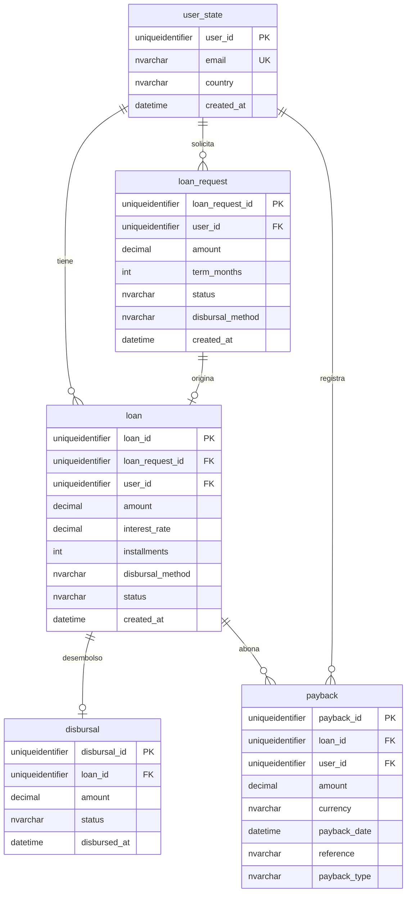

## Diagrama ER



### Relaciones resumidas

| Relación | Cardinalidad | Descripción |
|----------|--------------|-------------|
| user_state → loan_request | 1:N | Un usuario puede hacer múltiples solicitudes |
| user_state → loan | 1:N | Un usuario puede tener múltiples préstamos |
| loan_request → loan | 1:0..1 | Una solicitud puede convertirse en un préstamo |
| loan → disbursal | 1:0..1 | Un préstamo puede tener un desembolso |
| loan → payback | 1:N | Un préstamo puede tener múltiples pagos |

---

## Script SQL para crear las tablas

```sql
CREATE DATABASE VanaCreditSim;
GO

ALTER DATABASE VanaCreditSim SET RECOVERY FULL;
GO

USE VanaCreditSim;
GO

CREATE TABLE dbo.user_state (
    user_id UNIQUEIDENTIFIER NOT NULL PRIMARY KEY DEFAULT NEWSEQUENTIALID(),
    email NVARCHAR(320) NOT NULL,
    country CHAR(3) NOT NULL,
    created_at DATETIME2(3) NOT NULL DEFAULT SYSUTCDATETIME(),
    CONSTRAINT uq_user_state_email UNIQUE (email)
);
GO

CREATE TABLE dbo.loan_request (
    loan_request_id UNIQUEIDENTIFIER NOT NULL PRIMARY KEY DEFAULT NEWSEQUENTIALID(),
    user_id UNIQUEIDENTIFIER NOT NULL,
    amount DECIMAL(18,2) NOT NULL,
    term_months INT NOT NULL,
    status NVARCHAR(40) NOT NULL,
    disbursal_method NVARCHAR(20) NULL,
    created_at DATETIME2(3) NOT NULL DEFAULT SYSUTCDATETIME(),
    CONSTRAINT fk_loan_request_user_state FOREIGN KEY (user_id) REFERENCES dbo.user_state(user_id)
);
CREATE INDEX ix_loan_request_user_id ON dbo.loan_request(user_id);
GO

CREATE TABLE dbo.loan (
    loan_id UNIQUEIDENTIFIER NOT NULL PRIMARY KEY DEFAULT NEWSEQUENTIALID(),
    loan_request_id UNIQUEIDENTIFIER NOT NULL,
    user_id UNIQUEIDENTIFIER NOT NULL,
    amount DECIMAL(18,2) NOT NULL,
    interest_rate DECIMAL(9,6) NOT NULL,
    installments INT NOT NULL,
    disbursal_method NVARCHAR(20) NOT NULL,
    status NVARCHAR(40) NOT NULL,
    created_at DATETIME2(3) NOT NULL DEFAULT SYSUTCDATETIME(),
    CONSTRAINT uq_loan_loan_request UNIQUE (loan_request_id),
    CONSTRAINT fk_loan_loan_request FOREIGN KEY (loan_request_id) REFERENCES dbo.loan_request(loan_request_id),
    CONSTRAINT fk_loan_user_state FOREIGN KEY (user_id) REFERENCES dbo.user_state(user_id)
);
CREATE INDEX ix_user_state_id ON dbo.loan(user_id);
GO

CREATE TABLE dbo.disbursal (
    disbursal_id UNIQUEIDENTIFIER NOT NULL PRIMARY KEY DEFAULT NEWSEQUENTIALID(),
    loan_id UNIQUEIDENTIFIER NOT NULL,
    amount DECIMAL(18,2) NOT NULL,
    status NVARCHAR(30) NOT NULL,
    disbursed_at DATETIME2(3) NOT NULL,
    CONSTRAINT fk_disbursal_loan FOREIGN KEY (loan_id) REFERENCES dbo.loan(loan_id)
);
CREATE UNIQUE INDEX uq_disbursal_loan_id ON dbo.disbursal(loan_id);
GO

CREATE TABLE dbo.payback (
    payback_id UNIQUEIDENTIFIER NOT NULL PRIMARY KEY DEFAULT NEWSEQUENTIALID(),
    loan_id UNIQUEIDENTIFIER NOT NULL,
    user_id UNIQUEIDENTIFIER NOT NULL,
    amount DECIMAL(18,2) NOT NULL,
    currency CHAR(3) NOT NULL,
    payback_date DATETIME2(3) NOT NULL,
    reference NVARCHAR(80) NULL,
    payback_type NVARCHAR(30) NOT NULL,
    CONSTRAINT fk_payback_loan FOREIGN KEY (loan_id) REFERENCES dbo.loan(loan_id),
    CONSTRAINT fk_payback_user_state FOREIGN KEY (user_id) REFERENCES dbo.user_state(user_id)
);
CREATE INDEX ix_payback_loan_id ON dbo.payback(loan_id);
CREATE INDEX ix_payback_user_id ON dbo.payback(user_id);
GO
```

---

## Script SQL insertar datos

La distribución de `status` en `loan_request` deja **≥ 15 000** filas en `approved` cuando `@Requests = 20000` (tres de cada cuatro son `approved`), para poder insertar `@Loans = 15000` préstamos. La tabla `numbers` usa un `CROSS JOIN` extra para asegurar al menos **500 000** filas en instancias pequeñas.

```sql
SET NOCOUNT ON;

DECLARE @Users INT = 10000;
DECLARE @Requests INT = 20000;
DECLARE @Loans INT = 15000;
DECLARE @Paybacks INT = 500000;

IF OBJECT_ID('dbo.numbers','U') IS NOT NULL DROP TABLE dbo.numbers;
SELECT TOP (@Paybacks)
    n = ROW_NUMBER() OVER (ORDER BY (SELECT NULL))
INTO dbo.numbers
FROM sys.all_objects a
CROSS JOIN sys.all_objects b
CROSS JOIN sys.all_objects c
CROSS JOIN sys.all_objects d;

-- 1) Usuarios
INSERT INTO dbo.user_state (user_id, email, country)
SELECT TOP (@Users)
    NEWID(),
    CONCAT('user_', n, '@sim.vana.test'),
    CASE n % 5 WHEN 0 THEN 'GTM' WHEN 1 THEN 'HND' WHEN 2 THEN 'SLV' WHEN 3 THEN 'CRI' ELSE 'PAN' END
FROM dbo.numbers
ORDER BY n;

IF OBJECT_ID('tempdb..#U') IS NOT NULL DROP TABLE #U;
SELECT user_id, ROW_NUMBER() OVER (ORDER BY user_id) AS rn
INTO #U FROM dbo.user_state;

-- 2) Solicitudes (~75% approved para alimentar @Loans)
INSERT INTO dbo.loan_request (loan_request_id, user_id, amount, term_months, status, disbursal_method)
SELECT TOP (@Requests)
    NEWID(),
    u.user_id,
    CAST(500 + (n.n % 20000) AS DECIMAL(18,2)),
    6 + (n.n % 30),
    CASE n.n % 4
        WHEN 0 THEN N'pending'
        WHEN 1 THEN N'approved'
        WHEN 2 THEN N'approved'
        ELSE N'approved'
    END,
    CASE n.n % 2 WHEN 0 THEN N'transfer' ELSE N'gtc_rem' END
FROM dbo.numbers n
JOIN #U u ON u.rn = ((n.n - 1) % @Users) + 1
ORDER BY n.n;

IF OBJECT_ID('tempdb..#LR') IS NOT NULL DROP TABLE #LR;
SELECT loan_request_id, user_id,
       ROW_NUMBER() OVER (ORDER BY loan_request_id) AS rn
INTO #LR
FROM dbo.loan_request
WHERE status = N'approved';

INSERT INTO dbo.loan (loan_id, loan_request_id, user_id, amount, interest_rate, installments, disbursal_method, status)
SELECT TOP (@Loans)
    NEWID(),
    lr.loan_request_id,
    lr.user_id,
    CAST(1000 + (lr.rn % 50000) AS DECIMAL(18,2)),
    CAST(0.05 + (lr.rn % 100) / 10000.0 AS DECIMAL(9,6)),
    6 + (lr.rn % 24),
    CASE lr.rn % 2 WHEN 0 THEN N'transfer' ELSE N'gtc_rem' END,
    N'active'
FROM #LR lr
ORDER BY lr.rn;

INSERT INTO dbo.disbursal (disbursal_id, loan_id, amount, status, disbursed_at)
SELECT NEWID(), l.loan_id, l.amount, N'completed', DATEADD(DAY, -(l.rn % 120), SYSUTCDATETIME())
FROM (
    SELECT loan_id, amount, ROW_NUMBER() OVER (ORDER BY loan_id) AS rn
    FROM dbo.loan
) l;

IF OBJECT_ID('tempdb..#L2') IS NOT NULL DROP TABLE #L2;
SELECT loan_id, user_id, ROW_NUMBER() OVER (ORDER BY loan_id) AS rn
INTO #L2 FROM dbo.loan;

INSERT INTO dbo.payback (payback_id, loan_id, user_id, amount, currency, payback_date, reference, payback_type)
SELECT TOP (@Paybacks)
    NEWID(),
    x.loan_id,
    x.user_id,
    CAST(10 + (n.n % 500) AS DECIMAL(18,2)),
    CASE n.n % 3 WHEN 0 THEN 'GTQ' WHEN 1 THEN 'HNL' ELSE 'USD' END,
    DATEADD(DAY, -(n.n % 400), SYSUTCDATETIME()),
    CONCAT(N'REF-', n.n),
    CASE n.n % 3 WHEN 0 THEN N'transfer' WHEN 1 THEN N'cash' ELSE N'card' END
FROM dbo.numbers n
JOIN #L2 x ON x.rn = ((n.n - 1) % @Loans) + 1
ORDER BY n.n;

DROP TABLE dbo.numbers;
GO

SELECT 'user_state' AS t, COUNT(*) AS c FROM dbo.user_state
UNION ALL SELECT 'loan_request', COUNT(*) FROM dbo.loan_request
UNION ALL SELECT 'loan', COUNT(*) FROM dbo.loan
UNION ALL SELECT 'disbursal', COUNT(*) FROM dbo.disbursal
UNION ALL SELECT 'payback', COUNT(*) FROM dbo.payback;
GO
```

---

## Script SQL para crear el backup (FULL → DIFF → LOG)

```sql
USE VanaCreditSim;
GO

SELECT 'user_state' AS tabla, COUNT(*) AS filas FROM dbo.user_state
UNION ALL SELECT 'loan_request', COUNT(*) FROM dbo.loan_request
UNION ALL SELECT 'loan', COUNT(*) FROM dbo.loan
UNION ALL SELECT 'disbursal', COUNT(*) FROM dbo.disbursal
UNION ALL SELECT 'payback', COUNT(*) FROM dbo.payback;
GO

BACKUP DATABASE VanaCreditSim
TO DISK = N'C:\Program Files\Microsoft SQL Server\MSSQL15.MSSQLSERVER\MSSQL\Backup\VanaCreditSim_FULL.bak'
WITH FORMAT, INIT, NAME = N'Full Backup VanaCreditSim';
GO

INSERT INTO dbo.user_state (email, country)
VALUES (N'post_full@test.vana', N'GTM');
GO

BACKUP DATABASE VanaCreditSim
TO DISK = N'C:\Program Files\Microsoft SQL Server\MSSQL15.MSSQLSERVER\MSSQL\Backup\VanaCreditSim_DIFF.bak'
WITH DIFFERENTIAL, NAME = N'Differential Backup VanaCreditSim';
GO

INSERT INTO dbo.user_state (email, country)
VALUES (N'post_diff@test.vana', N'HND');
GO

BACKUP LOG VanaCreditSim
TO DISK = N'C:\Program Files\Microsoft SQL Server\MSSQL15.MSSQLSERVER\MSSQL\Backup\VanaCreditSim_LOG.trn'
WITH NAME = N'Log Backup VanaCreditSim';
GO
```

---

## Script SQL para restaurar la BD

```sql
USE master;
GO

ALTER DATABASE VanaCreditSim SET SINGLE_USER WITH ROLLBACK IMMEDIATE;
GO

DROP DATABASE VanaCreditSim;
GO

RESTORE DATABASE VanaCreditSim
FROM DISK = N'C:\Program Files\Microsoft SQL Server\MSSQL15.MSSQLSERVER\MSSQL\Backup\VanaCreditSim_FULL.bak'
WITH NORECOVERY, REPLACE;
GO

RESTORE DATABASE VanaCreditSim
FROM DISK = N'C:\Program Files\Microsoft SQL Server\MSSQL15.MSSQLSERVER\MSSQL\Backup\VanaCreditSim_DIFF.bak'
WITH NORECOVERY;
GO

RESTORE LOG VanaCreditSim
FROM DISK = N'C:\Program Files\Microsoft SQL Server\MSSQL15.MSSQLSERVER\MSSQL\Backup\VanaCreditSim_LOG.trn'
WITH RECOVERY;
GO

USE VanaCreditSim;
GO

SELECT COUNT(*) AS total_user_state FROM dbo.user_state;
GO
```
