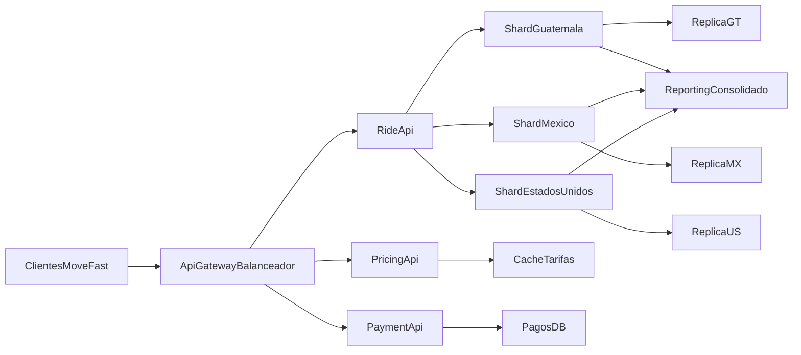

# Tarea 5 - MoveFast (CAP + Distribucion)

## Objetivo

Disenar una propuesta de base de datos distribuida para `MoveFast`, una app tipo Uber que opera en Guatemala, Mexico y Estados Unidos, aplicando teorema CAP, estrategias de sharding y replicacion, y una simulacion minima de caidas de nodos.

## Parte 1 - CAP Theorem

### 1) Propiedades elegidas

Para MoveFast se prioriza **AP (Availability + Partition Tolerance)**:

- **Availability (A):** la app debe responder siempre, aunque sea con informacion no totalmente fresca.
- **Partition Tolerance (P):** el sistema debe seguir operando aun cuando haya fallos de red entre regiones o centros de datos.

### 2) Justificacion con escenario real

Escenario: un usuario solicita viaje en Ciudad de Guatemala y, en ese momento, hay una particion de red entre el nodo principal de la region y un nodo remoto.

- Si se prioriza AP, el shard local sigue aceptando solicitudes y asignando conductores disponibles localmente.
- La consistencia global se corrige luego (consistencia eventual), por ejemplo al reconciliar estados de viajes o metadatos no criticos.

Esto es razonable para sistemas en tiempo real porque bloquear la solicitud de viaje por esperar consistencia fuerte empeora la experiencia del usuario.

### 3) Que pasa con una combinacion incorrecta

Si se prioriza **CP** de forma estricta para todas las operaciones:

- Durante particion, el sistema puede rechazar operaciones para proteger consistencia.
- El usuario podria no poder pedir viaje, ver ETA o confirmar conductor.
- El negocio pierde transacciones justo cuando mas importa disponibilidad.

Riesgo practico: convertir una falla parcial de red en una caida funcional completa para el cliente.

## Parte 2 - Sharding vs Replication

### A) Como se divide la base de datos

Se propone un esquema mixto:

- **Shard primario por pais:** `GT`, `MX`, `US`.
- **Subshard logico por ciudad** dentro de cada pais para distribuir carga de viajes en tiempo real.
- **Catalogos globales** en base separada (tipos de vehiculo, tarifas base, monedas, metodos de pago).

Con esto, la mayor parte de consultas de viajes se resuelven localmente donde ocurre la operacion.

### B) Tipo de replicacion

- **Replicacion asincrona** entre primario y replica por shard para alta disponibilidad.
- **Replica de lectura** para reporteria y consultas analiticas.
- **Failover operacional**: ante caida del primario regional, se promueve replica para continuidad.

### C) Justificacion (rendimiento, escalabilidad y riesgos)

- **Rendimiento:** baja latencia por afinidad geografica.
- **Escalabilidad:** se agregan nodos por pais/ciudad sin afectar toda la plataforma.
- **Riesgos:** inconsistencia temporal por asincronia; se mitiga con reconciliacion y reglas de idempotencia en eventos de viaje/pago.

## Parte 3 - Caso Real seleccionado: Uber

### 1) Tipo de base de datos

Uber usa arquitectura poliglota (segun dominio):

- motores relacionales para componentes transaccionales criticos,
- soluciones NoSQL/distribuidas para volumen alto, geolocalizacion, eventos y telemetria.

### 2) Como aplican distribucion y replicacion

- particionado geografico por regiones,
- replicacion entre centros de datos,
- servicios desacoplados por dominio (viajes, pricing, pagos, matching).

### 3) Que priorizan en CAP

En funciones de tiempo real, suele priorizarse **AP** para continuidad operativa, con consistencia eventual en datos no estrictamente financieros y controles adicionales en pagos/fraude para proteger integridad.

Referencia:

- [Uber Engineering](https://www.uber.com/blog/engineering/)

## Parte 4 - Diseno de arquitectura MoveFast

### Componentes

- `API Gateway + Balanceador`
- `Ride API` (solicitudes/asignacion de viajes)
- `Pricing API` (tarifa dinamica)
- `Payment API` (cobro y conciliacion)
- `Shards por pais` (GT, MX, US) con replicas
- `DB de catalogos globales`
- `DB consolidada de reporting`

### Consideraciones de fallos y concurrencia

- **Fallos de red:** cada shard opera de forma local y replica en modo asincrono.
- **Alta concurrencia:** particion por pais/ciudad reduce hot spots.
- **Tiempo real:** lecturas operativas en nodo local y degradacion controlada en incidentes.

### Diagrama de arquitectura

## Guia de ejecucion de archivos

1. Ejecutar `movefast_distribuida.sql` en SQL Server Management Studio (por bloques `GO`).
2. Verificar vistas y agregados en `DB_Reporting_MoveFast`.
3. Ejecutar `simulador_fallos.py` para observar caidas de nodos y conmutacion logica.

## Entregables incluidos

- `README.md` (este documento)
- `movefast_distribuida.sql`
- `simulador_fallos.py`
